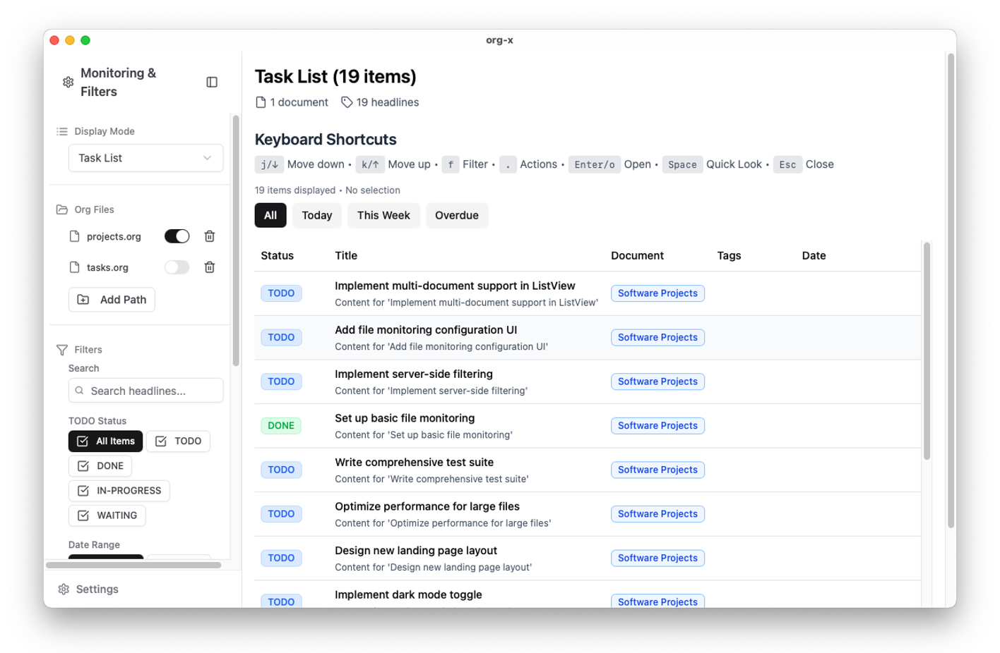

# Org-X

> **Note:** This is a work-in-progress project and is not yet ready for production use. It also serves as an experiment in agentic coding, with the vast majority of the code being written by an AI. Features are incomplete and may change.



Org-X is a cross-platform desktop application built with Tauri and Svelte to view Org-mode files in a modern, interface. It aims to manage text-based Org-mode files with a visually rich and keyboard-centric experience.

## ✨ Key Features

*   **Modern UI**: Displays Org-mode files in a hierarchical and sophisticated interface inspired by Notion.
*   **Advanced Task Management**: Extracts TODO items and allows filtering, sorting, and grouping based on status, tags, dates, and custom properties.
*   **Keyboard-First Design**: Supports Emacs-style keybindings and a command palette, enabling most operations without a mouse.
*   **File Monitoring**: Automatically detects changes in specified files and directories, updating the view in real-time.
*   **High Customizability**: Allows flexible configuration of user-defined TODO keywords, custom properties, and display columns.
*   **Read-Only Viewer**: Safely displays your existing Org-mode files. Editing is done in your preferred external editor.

## 🚧 Project Status

**Actively in Development (MVP Focus)**

The project is currently focused on developing a Minimum Viable Product (MVP) centered around a robust **Task List View**. We are incrementally building features and have established a solid architectural foundation.

**Recently Completed:**

*   **Configurable File Monitoring**: A complete system for users to specify which files and directories to monitor.
*   **Settings UI**: Implemented settings for managing TODO keywords, custom properties, external editor commands, and table columns.
*   **MVVM Architecture**: Refactored major UI components to a Model-View-ViewModel pattern for better maintainability and testability.
*   **Advanced Filtering Logic**: Improved task filtering to correctly handle hierarchies (e.g., showing tasks under notes but excluding sub-tasks under other tasks).
*   **UI Enhancements**:
    *   Moved from tabs to a sidebar-based display mode selector (`Task List` vs. `Headline List`).
    *   Implemented responsive and interactive breadcrumb navigation for deeply nested views.

## 🗺️ Roadmap (To-Do)

Our immediate goal is to complete the core Task List View. Future development will focus on expanding viewing and organization capabilities.

**Immediate Focus:**

*   **Complete the Task List View**:
    *   Implement collapsible hierarchical display for parent headlines.
    *   Enhance keyboard navigation and row interactions.
    *   Improve UI/UX for filtering, sorting, and grouping.
*   **Backend Filtering**: Enhance server-side filtering performance and capabilities in Rust.

**Future Development (Post-MVP):**

*   **Multiple Custom Views**: Allow users to save and switch between different view configurations (like tabs).
*   **Advanced Sorting & Grouping**: Introduce multi-level sorting and grouping options.
*   **New View Modes**:
    *   Kanban Board View
    *   Timeline / Gantt Chart View
*   **Full-Fledged Settings Screen**: Complete all planned customization options.

## 🛠️ Tech Stack

*   **Backend**: Rust, Tauri 2.0, Orgize
*   **Frontend**: Svelte 5, TypeScript, Vite
*   **UI**: TailwindCSS, shadcn-svelte
*   **Type Bindings**: tauri-specta

## 🚀 Getting Started

To get started with development, you'll need the following tools:

*   Node.js (v18+)
*   Rust (1.75.0+)
*   pnpm

Follow these steps to set up the project:

```bash
# 1. Clone the repository
git clone https://github.com/dr-yst/org-x.git
cd org-x

# 2. Install dependencies
pnpm install

# 3. Start the development server
pnpm tauri dev
```

## 📐 Architecture

Org-X is a Tauri application that combines a fast Rust backend with a reactive Svelte 5 frontend.

*   **Rust Backend**: Handles core logic, including parsing Org-mode files with the `Orgize` library, file monitoring, and data processing.
*   **Svelte Frontend**: Renders the parsed data into a rich user interface. It uses Svelte 5's `Runes` for state management and `shadcn-svelte` for UI components.
*   **MVVM Pattern**: Complex UI components are structured using the Model-View-ViewModel (MVVM) pattern to separate business logic from the view.

For more detailed information on the project's design principles and architectural decisions, please refer to the documents in the `dev-docs/` directory.


## Contributing

We welcome contributions to Org-X! If you're interested in helping, please feel free to fork the repository and submit a pull request.

## License

This project is licensed under the **Apache License 2.0**.

See the [LICENSE](LICENSE) file for the full license text.
