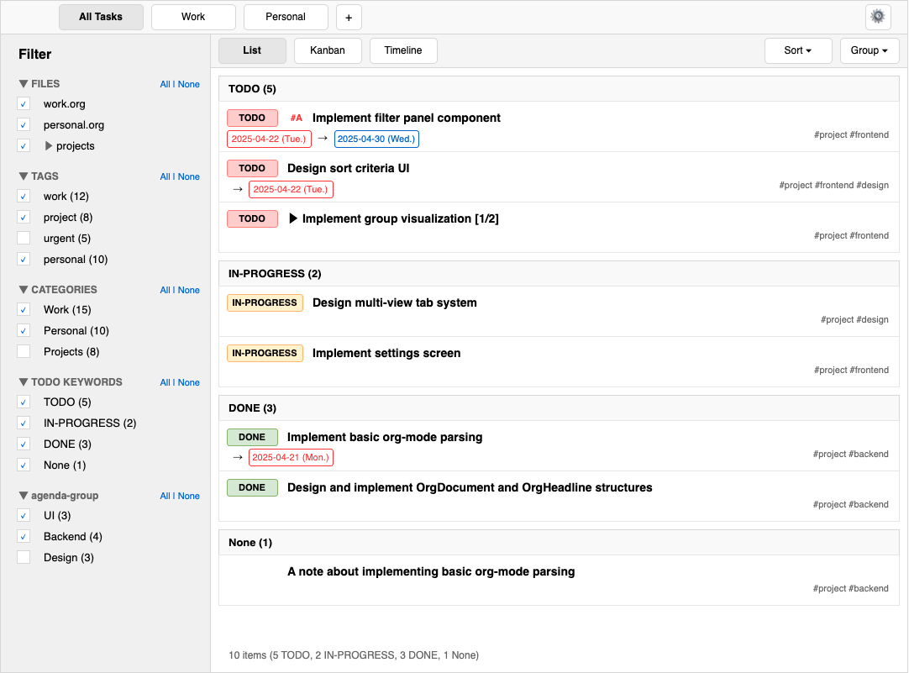

# Org-X System Patterns

## System Architecture

### High-Level Architecture
Org-X consists of the following main components:

```
+----------------------------+
|        Frontend            |
|      (Svelte + Svelte 5)   |
+------------+---------------+
             |
             | Tauri IPC
             |
+------------v---------------+
|         Backend            |
|           (Rust)           |
+------------+---------------+
             |
             | File I/O
             |
+------------v---------------+
|       org-mode files       |
+----------------------------+
```

1. **Frontend (Svelte 5 + TypeScript)**
   - User interface
   - State management (Svelte 5 runes)
   - Event handling

2. **Backend (Rust + Tauri)**
   - org-mode file parsing (Orgize library)
   - File system operations
   - External editor integration

3. **Type Definition Sharing (tauri-specta)**
   - Synchronization of type definitions between frontend and backend

### Data Flow

```
[Org Files] --> [Orgize Parser] --> [Structured Data] --> [Tauri Commands] --> [UI Display in Svelte Components]
```

During updates:
```
[Editing in External Editor] --> [File Change Detection] --> [Re-parsing] --> [UI Update]
```

## Key Component Design

### Backend Components

#### Org Parser Module
- `orgmode.rs` - Converts org-mode files to structured data using the Orgize library
- Responsibilities:
  - Parsing org-mode files
  - Extracting headlines, TODO items, tags, etc.
  - Providing JSON serializable structures

#### File System Module
- `filesystem.rs` - File system operations (planned)
- Responsibilities:
  - Scanning folders
  - Monitoring file changes
  - Notifying of file change events

#### External Integration Module
- `external_editor.rs` - Integration with external editors (planned)
- Responsibilities:
  - Opening files/sections in external editors
  - Executing editor commands

#### Global Metadata Manager
- `metadata_manager.rs` - Manages global metadata across all org files
- Responsibilities:
  - Tracking all unique tags across documents
  - Tracking all categories across documents
  - Providing filtering capabilities based on metadata
  - Maintaining metadata statistics

#### Settings Manager
- `settings_manager.rs` - Manages user settings and preferences (planned)
- Responsibilities:
  - Storing and retrieving user settings
  - Managing custom TODO keywords
  - Configuring file monitoring targets and intervals
  - Handling user-defined properties

### Frontend Components

#### Core Components
- `OrgDocument.svelte` - Rendering the entire org document
- `OrgHeadline.svelte` - Rendering and collapsing headings
- `OrgContent.svelte` - Rendering content sections

#### View Components
- `ListView.svelte` - List format display (basic view)
- `KanbanView.svelte` - Kanban format display (planned)
- `TimelineView.svelte` - Timeline (Gantt chart) format display (planned)

#### Interaction Components
- `KeyboardHandler.svelte` - Processing keyboard shortcuts
- `CommandPalette.svelte` - Command palette UI
- `StatusBar.svelte` - Status bar and minibuffer

#### Metadata Components
- `TagBrowser.svelte` - Browse and filter by tags
- `CategoryBrowser.svelte` - Browse and filter by categories
- `MetadataStatistics.svelte` - Display statistics about tags and categories

#### New UI Components
- `AppHeader.svelte` - Main application header with view tabs
- `ViewTabs.svelte` - Tabs for switching between saved views
- `ViewDisplayTabs.svelte` - Tabs for switching display modes within a view
- `FilterPanel.svelte` - Advanced filtering with multiple conditions
- `SortPanel.svelte` - Multi-criteria sorting controls
- `GroupPanel.svelte` - Flexible grouping controls
- `SettingsDialog.svelte` - Settings screen for customization
- `Sidebar.svelte` - Application sidebar with navigation and filters

## UI Patterns

### A UI Mock Design
Here is a mock design of the application interface:


### Multi-View Tab System
The application uses a two-level tab system:

1. **View Tabs (top level)**
   - Each tab represents a saved view with its own configuration
   - Users can create, rename, and delete views
   - View state (filters, sort, grouping, display mode) is persisted

2. **Display Mode Tabs (second level)**
   - Within each view, users can switch between display modes:
     - List view
     - Kanban board
     - Timeline (Gantt chart)
     - Custom display modes (user-defined)
   - Each display mode maintains its own layout settings and custom variables

### Sidebar-Based Filtering
The filtering system uses a sidebar with checkboxes for intuitive selection:

1. **Filter Categories**
   - Files (org-mode files in the system)
   - Tags (from headlines and file tags)
   - Categories (from headlines and documents)
   - TODO Keywords (including None for non-task headlines)
   - User-defined properties (e.g., agenda-group)

2. **Filter Operations**
   - Checkbox selection for inclusion/exclusion
   - Collapsible sections for each filter category
   - "All | None" quick toggles for each section
   - Hierarchical organization (e.g., files can contain sub-folders)

3. **Filter Persistence**
   - Filter state is saved with each view
   - Filters apply across all display modes within a view

### Multi-Criteria Sorting
The sorting system supports:

1. **Primary and Secondary Sort**
   - Multiple sort criteria in order of precedence
   - Each criterion can be ascending or descending

2. **Sort Fields**
   - Date fields (due, scheduled, created)
   - Priority
   - TODO status
   - Title
   - Custom properties

### Flexible Grouping
The grouping system allows organizing content by:

1. **Group By Fields**
   - TODO status
   - Priority
   - Tags
   - Categories
   - Custom properties
   - Due/scheduled dates (by day, week, month)

2. **Group Visualization**
   - Collapsible groups
   - Group headers with count and summary
   - Nested groups (up to 2 levels)
   - Visual separation between groups

3. **Group Operations**
   - Collapse/expand all groups
   - Focus on specific group
   - Sort groups by name, count, or custom criteria

### Custom Display Mode Variables
Each display mode supports custom variable definitions:

1. **List View Variables**
   - Column visibility and order
   - Row height and density
   - Grouping visualization style
   - Date format preferences

2. **Kanban View Variables**
   - Column definition (by TODO status or custom property)
   - Card content and format
   - WIP limits
   - Swimlanes configuration

3. **Timeline View Variables**
   - Time scale (day, week, month)
   - Row grouping
   - Display of dependencies
   - Milestone visualization

4. **Variable Persistence**
   - Variables are saved per display mode within each view
   - Default templates available for quick setup

## Data Model

// OrgTitle structure representing headline titles in org-mode
#[derive(Debug, Clone, Serialize, Deserialize)]
pub struct OrgTitle {
    pub raw: String,                   // Raw title text
    pub priority: Option<char>,        // Priority cookie (A, B, C, etc)
    pub tags: Vec<String>,             // Tags associated with the title
    pub todo_keyword: Option<String>,  // TODO keyword if present
    pub properties: HashMap<String, String>, // Properties associated with this headline
}

impl OrgTitle {
    // Create a new OrgTitle from basic components
    pub fn new(
        raw: String,
        priority: Option<char>,
        tags: Vec<String>,
        todo_keyword: Option<String>,
    ) -> Self {
        Self {
            raw,
            priority,
            tags,
            todo_keyword,
            properties: HashMap::new(),
        }
    }

    // Create a simple OrgTitle with just the raw title text
    pub fn simple(raw: &str) -> Self {
        Self {
            raw: raw.to_string(),
            priority: None,
            tags: Vec::new(),
            todo_keyword: None,
            properties: HashMap::new(),
        }
    }

    // Get a property value if it exists
    pub fn get_property(&self, key: &str) -> Option<&str> {
        self.properties.get(key).map(|s| s.as_str())
    }

    // Set a property value
    pub fn set_property(&mut self, key: String, value: String) {
        self.properties.insert(key, value);
    }
}

### Dynamic TODO status representation
```rust
// Dynamic TODO status representation
#[derive(Debug, Clone, PartialEq, Eq, Serialize, Deserialize)]
pub struct TodoStatus {
    pub keyword: String,      // The actual keyword (e.g., "TODO", "DONE", "IN-PROGRESS")
    pub state_type: StateType, // Whether it's active or closed
    pub order: u32,           // Order in the sequence
    pub color: Option<String>, // Optional color for UI display
}

#[derive(Debug, Clone, PartialEq, Eq, Serialize, Deserialize)]
pub enum StateType {
    Active,
    Closed,
}

impl TodoStatus {
    pub fn is_active(&self) -> bool {
        self.state_type == StateType::Active
    }

    pub fn is_closed(&self) -> bool {
        self.state_type == StateType::Closed
    }

    // Create standard TODO status
    pub fn todo() -> Self {
        Self {
            keyword: "TODO".to_string(),
            state_type: StateType::Active,
            order: 0,
            color: Some("#ff0000".to_string()), // Red
        }
    }

    // Create standard DONE status
    pub fn done() -> Self {
        Self {
            keyword: "DONE".to_string(),
            state_type: StateType::Closed,
            order: 100,
            color: Some("#00ff00".to_string()), // Green
        }
    }
}

// Configuration for TODO sequences
#[derive(Debug, Clone, Serialize, Deserialize)]
pub struct TodoConfiguration {
    pub sequences: Vec<TodoSequence>,
    pub default_sequence: String,
}

#[derive(Debug, Clone, Serialize, Deserialize)]
pub struct TodoSequence {
    pub name: String,
    pub statuses: Vec<TodoStatus>,
}

impl TodoConfiguration {
    // Create default configuration
    pub fn default() -> Self {
        let default_sequence = TodoSequence {
            name: "default".to_string(),
            statuses: vec![
                TodoStatus {
                    keyword: "TODO".to_string(),
                    state_type: StateType::Active,
                    order: 0,
                    color: Some("#ff0000".to_string()),
                },
                TodoStatus {
                    keyword: "IN-PROGRESS".to_string(),
                    state_type: StateType::Active,
                    order: 10,
                    color: Some("#ff9900".to_string()),
                },
                TodoStatus {
                    keyword: "WAITING".to_string(),
                    state_type: StateType::Active,
                    order: 20,
                    color: Some("#ffff00".to_string()),
                },
                TodoStatus {
                    keyword: "DONE".to_string(),
                    state_type: StateType::Closed,
                    order: 100,
                    color: Some("#00ff00".to_string()),
                },
                TodoStatus {
                    keyword: "CANCELLED".to_string(),
                    state_type: StateType::Closed,
                    order: 110,
                    color: Some("#999999".to_string()),
                },
            ],
        };

        Self {
            sequences: vec![default_sequence.clone()],
            default_sequence: default_sequence.name,
        }
    }

    // Find status by keyword
    pub fn find_status(&self, keyword: &str) -> Option<&TodoStatus> {
        for sequence in &self.sequences {
            for status in &sequence.statuses {
                if status.keyword == keyword {
                    return Some(status);
                }
            }
        }
        None
    }

    // Parse org-mode TODO configuration
    pub fn from_org_config(config_lines: &[String]) -> Self {
        // Parse #+TODO: lines from org files
        // Example: #+TODO: TODO IN-PROGRESS WAITING | DONE CANCELLED
        // This would require parsing logic to extract sequences
        todo!()
    }
}

// Basic org-mode document structure
#[derive(Debug, Clone, Serialize, Deserialize)]
pub struct OrgDocument {
    pub id: String,
    pub title: String,
    pub content: String,
    pub headlines: Vec<OrgHeadline>,
    pub filetags: Vec<String>,
    pub parsed_at: String,
    pub file_path: String,
    pub properties: HashMap<String, String>, // Content from :PROPERTIES: drawer
    pub category: String, // Category from #+CATEGORY: line
    pub etag: String, // Entity tag for change detection
    pub todo_config: Option<TodoConfiguration>, // Extracted from file
}

// Basic headline structure
#[derive(Debug, Clone, Serialize, Deserialize)]
pub struct OrgHeadline {
    pub id: String,
    pub document_id: String, // Reference to parent document
    pub level: u32,
    pub title: OrgTitle, // Using OrgTitle instead of plain String
    pub tags: Vec<String>, // Kept for backward compatibility (also in OrgTitle)
    pub todo_keyword: Option<String>, // Kept for backward compatibility (also in OrgTitle)
    pub priority: Option<String>, // Kept for backward compatibility (also in OrgTitle)
    pub content: String,
    pub children: Vec<OrgHeadline>,
    pub properties: HashMap<String, String>, // Content from PROPERTIES drawer
    pub etag: String, // Entity tag for change detection
}

impl OrgHeadline {
    // Check if this headline is a task (has a TODO keyword)
    pub fn is_task(&self) -> bool {
        self.todo_keyword.is_some()
    }

    // Check if this headline is a note (no TODO keyword)
    pub fn is_note(&self) -> bool {
        !self.is_task()
    }

    // Get due date (from PROPERTIES)
    pub fn due_date(&self) -> Option<&str> {
        self.get_property("DEADLINE")
    }

    // Get scheduled date (from PROPERTIES)
    pub fn scheduled_date(&self) -> Option<&str> {
        self.get_property("SCHEDULED")
    }

    // Generic property accessor
    pub fn get_property(&self, key: &str) -> Option<&str> {
        // First check headline properties
        if let Some(value) = self.properties.get(key) {
            return Some(value);
        }

        // Then check title properties
        self.title.get_property(key)
    }

    // Get effective category (from headline properties or parent document)
    pub fn get_category(&self, document: &OrgDocument) -> String {
        // First check headline properties
        if let Some(category) = self.get_property("CATEGORY") {
            return category.to_string();
        }

        // Fall back to document category
        document.category.clone()
    }

    // Get the TODO status information
    pub fn get_todo_status(&self, config: &Option<TodoConfiguration>) -> Option<&TodoStatus> {
        let keyword = self.todo_keyword.as_ref()?;

        if let Some(config) = config {
            config.find_status(keyword)
        } else {
            None
        }
    }

    // Find parent headline
    pub fn parent<'a>(&self, document: &'a OrgDocument) -> Option<&'a OrgHeadline> {
        // Helper function to find parent recursively
        fn find_parent<'a>(headline: &OrgHeadline, candidates: &'a [OrgHeadline]) -> Option<&'a OrgHeadline> {
            for candidate in candidates {
                // Direct child check
                if candidate.children.iter().any(|child| child.id == headline.id) {
                    return Some(candidate);
                }

                // Recursive search in children
                if let Some(parent) = find_parent(headline, &candidate.children) {
                    return Some(parent);
                }
            }
            None
        }

        find_parent(self, &document.headlines)
    }

    // Find previous sibling
    pub fn previous<'a>(&self, document: &'a OrgDocument) -> Option<&'a OrgHeadline> {
        if let Some(parent) = self.parent(document) {
            // Find position in parent's children
            let self_index = parent.children.iter().position(|child| child.id == self.id)?;
            if self_index > 0 {
                return Some(&parent.children[self_index - 1]);
            }
        } else if self.level == 1 {
            // Top-level headline, search in document.headlines
            let self_index = document.headlines.iter().position(|h| h.id == self.id)?;
            if self_index > 0 {
                return Some(&document.headlines[self_index - 1]);
            }
        }
        None
    }

    // Find next sibling
    pub fn next<'a>(&self, document: &'a OrgDocument) -> Option<&'a OrgHeadline> {
        if let Some(parent) = self.parent(document) {
            // Find position in parent's children
            let self_index = parent.children.iter().position(|child| child.id == self.id)?;
            if self_index < parent.children.len() - 1 {
                return Some(&parent.children[self_index + 1]);
            }
        } else if self.level == 1 {
            // Top-level headline, search in document.headlines
            let self_index = document.headlines.iter().position(|h| h.id == self.id)?;
            if self_index < document.headlines.len() - 1 {
                return Some(&document.headlines[self_index + 1]);
            }
        }
        None
    }

    // Check if content has changed compared to another headline
    pub fn content_changed(&self, other: &OrgHeadline) -> bool {
        self.content != other.content || self.title.raw != other.title.raw
    }

    // Check if structure has changed compared to another headline
    pub fn structure_changed(&self, other: &OrgHeadline) -> bool {
        if self.children.len() != other.children.len() {
            return true;
        }

        // Check children recursively
        for (self_child, other_child) in self.children.iter().zip(other.children.iter()) {
            if self_child.structure_changed(other_child) {
                return true;
            }
        }

        false
    }

    // Find all task headlines (recursive)
    pub fn find_tasks(&self) -> Vec<&OrgHeadline> {
        let mut tasks = Vec::new();

        // Add self if it's a task
        if self.is_task() {
            tasks.push(self);
        }

        // Recursively add tasks from children
        for child in &self.children {
            tasks.extend(child.find_tasks());
        }

        tasks
    }

    // Find all note headlines (recursive)
    pub fn find_notes(&self) -> Vec<&OrgHeadline> {
        let mut notes = Vec::new();

        // Add self if it's a note
        if self.is_note() {
            notes.push(self);
        }

        // Recursively add notes from children
        for child in &self.children {
            notes.extend(child.find_notes());
        }

        notes
    }
}
}

// Unified headline approach for both tasks and notes
// Tasks and notes are both represented by OrgHeadline, distinguished by todo_keyword
// A headline with a todo_keyword is considered a task, one without is a note

// Helper functions for working with headlines
impl OrgHeadline {
    // Check if this headline is a task (has a TODO keyword)
    pub fn is_task(&self) -> bool {
        self.todo_keyword.is_some()
    }

    // Check if this headline is a note (no TODO keyword)
    pub fn is_note(&self) -> bool {
        self.todo_keyword.is_none()
    }

    // Get due date (from PROPERTIES)
    pub fn due_date(&self) -> Option<&str> {
        self.properties.get("DEADLINE").map(|s| s.as_str())
    }

    // Get scheduled date (from PROPERTIES)
    pub fn scheduled_date(&self) -> Option<&str> {
        self.properties.get("SCHEDULED").map(|s| s.as_str())
    }

    // Get effective category (from headline properties or parent document)
    pub fn get_category(&self, document: &OrgDocument) -> String {
        // First check headline properties
        if let Some(category) = self.properties.get("CATEGORY") {
            return category.clone();
        }

        // Fall back to document category
        document.category.clone()
    }

    // Get resolved TODO status with color and state information
    pub fn get_todo_status(&self, config: &TodoConfiguration) -> Option<TodoStatus> {
        if let Some(keyword) = &self.todo_keyword {
            config.find_status(keyword).cloned()
        } else {
            None
        }
    }

    // Find all task headlines (recursive)
    pub fn find_tasks(&self) -> Vec<&OrgHeadline> {
        let mut tasks = Vec::new();

        // Add self if it's a task
        if self.is_task() {
            tasks.push(self);
        }

        // Add tasks from children
        for child in &self.children {
            tasks.extend(child.find_tasks());
        }

        tasks
    }

    // Find all note headlines (recursive)
    pub fn find_notes(&self) -> Vec<&OrgHeadline> {
        let mut notes = Vec::new();

        // Add self if it's a note
        if self.is_note() {
            notes.push(self);
        }

        // Add notes from children
        for child in &self.children {
            notes.extend(child.find_notes());
        }

        notes
    }
}

// New models for UI state management

// View configuration model
#[derive(Debug, Clone, Serialize, Deserialize)]
pub struct ViewConfig {
    pub id: String,
    pub name: String,
    pub display_mode: DisplayMode,
    pub filter: FilterConfig,
    pub sort: SortConfig,
    pub group: GroupConfig,
    pub is_default: bool,
}

#[derive(Debug, Clone, Serialize, Deserialize)]
pub enum DisplayMode {
    List,
    Kanban,
    Timeline,
    Custom(String),
}

// Filter configuration
#[derive(Debug, Clone, Serialize, Deserialize)]
pub struct FilterConfig {
    pub conditions: Vec<FilterCondition>,
    pub operator: FilterOperator,
}

#[derive(Debug, Clone, Serialize, Deserialize)]
pub enum FilterOperator {
    And,
    Or,
}

#[derive(Debug, Clone, Serialize, Deserialize)]
pub enum FilterCondition {
    Tag(TagFilter),
    Category(CategoryFilter),
    TodoStatus(TodoStatusFilter),
    Priority(PriorityFilter),
    Date(DateFilter),
    Property(PropertyFilter),
    Compound(Box<FilterConfig>),
}

#[derive(Debug, Clone, Serialize, Deserialize)]
pub struct TagFilter {
    pub tags: Vec<String>,
    pub operator: FilterOperator,
}

#[derive(Debug, Clone, Serialize, Deserialize)]
pub struct CategoryFilter {
    pub categories: Vec<String>,
    pub operator: FilterOperator,
}

#[derive(Debug, Clone, Serialize, Deserialize)]
pub struct TodoStatusFilter {
    pub statuses: Vec<String>,
    pub include_active: Option<bool>,
    pub include_closed: Option<bool>,
}

#[derive(Debug, Clone, Serialize, Deserialize)]
pub struct PriorityFilter {
    pub priorities: Vec<char>,
}

#[derive(Debug, Clone, Serialize, Deserialize)]
pub struct DateFilter {
    pub field: DateField,
    pub operator: DateOperator,
    pub value: String,
}

#[derive(Debug, Clone, Serialize, Deserialize)]
pub enum DateField {
    Due,
    Scheduled,
    Created,
    Modified,
}

#[derive(Debug, Clone, Serialize, Deserialize)]
pub enum DateOperator {
    Before,
    After,
    On,
    Between,
}

#[derive(Debug, Clone, Serialize, Deserialize)]
pub struct PropertyFilter {
    pub property: String,
    pub operator: PropertyOperator,
    pub value: String,
}

#[derive(Debug, Clone, Serialize, Deserialize)]
pub enum PropertyOperator {
    Equals,
    Contains,
    StartsWith,
    EndsWith,
    GreaterThan,
    LessThan,
}

// Sort configuration
#[derive(Debug, Clone, Serialize, Deserialize)]
pub struct SortConfig {
    pub criteria: Vec<SortCriterion>,
}

#[derive(Debug, Clone, Serialize, Deserialize)]
pub struct SortCriterion {
    pub field: SortField,
    pub direction: SortDirection,
}

#[derive(Debug, Clone, Serialize, Deserialize)]
pub enum SortField {
    Title,
    Priority,
    TodoStatus,
    DueDate,
    ScheduledDate,
    CreatedDate,
    ModifiedDate,
    Property(String),
}

#[derive(Debug, Clone, Serialize, Deserialize)]
pub enum SortDirection {
    Ascending,
    Descending,
}

// Group configuration
#[derive(Debug, Clone, Serialize, Deserialize)]
pub struct GroupConfig {
    pub enabled: bool,
    pub fields: Vec<GroupField>,
    pub collapsed_by_default: bool,
}

#[derive(Debug, Clone, Serialize, Deserialize)]
pub enum GroupField {
    TodoStatus,
    Priority,
    Tag(String),
    Category,
    Property(String),
    DueDate(DateGrouping),
    ScheduledDate(DateGrouping),
}

#[derive(Debug, Clone, Serialize, Deserialize)]
pub enum DateGrouping {
    Day,
    Week,
    Month,
    Quarter,
    Year,
}

// Optional view models for UI-specific state
#[derive(Debug, Clone, Serialize, Deserialize)]
pub struct HeadlineView {
    pub headline_id: String,     // Reference to the original headline
    pub is_expanded: bool,       // UI state (expanded/collapsed)
    pub display_level: u32,      // Display level (may differ from actual level due to filtering)
    pub visible_children: Vec<String>, // IDs of visible children
}

// Global tag and category management
#[derive(Debug, Clone, Serialize, Deserialize)]
pub struct TagInfo {
    pub name: String,
    pub count: usize,            // Number of occurrences
    pub documents: Vec<String>,  // Document IDs where this tag appears
    pub headlines: Vec<String>,  // Headline IDs where this tag appears
}

#[derive(Debug, Clone, Serialize, Deserialize)]
pub struct CategoryInfo {
    pub name: String,
    pub count: usize,            // Number of occurrences
    pub documents: Vec<String>,  // Document IDs where this category appears
    pub headlines: Vec<String>,  // Headline IDs where this category appears
}

// Global metadata manager
#[derive(Debug, Clone, Serialize, Deserialize)]
pub struct GlobalMetadata {
    pub tags: HashMap<String, TagInfo>,
    pub categories: HashMap<String, CategoryInfo>,
    pub last_updated: String,
}

impl GlobalMetadata {
    pub fn new() -> Self {
        Self {
            tags: HashMap::new(),
            categories: HashMap::new(),
            last_updated: chrono::Utc::now().to_rfc3339(),
        }
    }

    // Register a tag from a headline
    pub fn register_tag(&mut self, tag: &str, document_id: &str, headline_id: &str) {
        let tag_info = self.tags.entry(tag.to_string()).or_insert(TagInfo {
            name: tag.to_string(),
            count: 0,
            documents: Vec::new(),
            headlines: Vec::new(),
        });

        tag_info.count += 1;

        if !tag_info.documents.contains(&document_id.to_string()) {
            tag_info.documents.push(document_id.to_string());
        }

        if !tag_info.headlines.contains(&headline_id.to_string()) {
            tag_info.headlines.push(headline_id.to_string());
        }

        self.last_updated = chrono::Utc::now().to_rfc3339();
    }

    // Register a category from a headline or document
    pub fn register_category(&mut self, category: &str, document_id: &str, headline_id: Option<&str>) {
        let category_info = self.categories.entry(category.to_string()).or_insert(CategoryInfo {
            name: category.to_string(),
            count: 0,
            documents: Vec::new(),
            headlines: Vec::new(),
        });

        category_info.count += 1;

        if !category_info.documents.contains(&document_id.to_string()) {
            category_info.documents.push(document_id.to_string());
        }

        if let Some(headline_id) = headline_id {
            if !category_info.headlines.contains(&headline_id.to_string()) {
                category_info.headlines.push(headline_id.to_string());
            }
        }

        self.last_updated = chrono::Utc::now().to_rfc3339();
    }

    // Get all tags sorted by occurrence count
    pub fn get_tags_by_count(&self) -> Vec<&TagInfo> {
        let mut tags: Vec<&TagInfo> = self.tags.values().collect();
        tags.sort_by(|a, b| b.count.cmp(&a.count));
        tags
    }

    // Get all categories sorted by occurrence count
    pub fn get_categories_by_count(&self) -> Vec<&CategoryInfo> {
        let mut categories: Vec<&CategoryInfo> = self.categories.values().collect();
        categories.sort_by(|a, b| b.count.cmp(&a.count));
        categories
    }

    // Find headlines with specific tag
    pub fn find_headlines_with_tag(&self, tag: &str) -> Vec<String> {
        match self.tags.get(tag) {
            Some(tag_info) => tag_info.headlines.clone(),
            None => Vec::new(),
        }
    }

    // Find headlines with specific category
    pub fn find_headlines_with_category(&self, category: &str) -> Vec<String> {
        match self.categories.get(category) {
            Some(category_info) => category_info.headlines.clone(),
            None => Vec::new(),
        }
    }
}

// User settings model
#[derive(Debug, Clone, Serialize, Deserialize)]
pub struct UserSettings {
    pub todo_configuration: TodoConfiguration,
    pub monitored_paths: Vec<MonitoredPath>,
    pub monitoring_interval_seconds: u32,
    pub custom_properties: Vec<CustomProperty>,
    pub views: Vec<ViewConfig>,
    pub default_view_id: String,
    pub theme: Theme,
}

#[derive(Debug, Clone, Serialize, Deserialize)]
pub struct MonitoredPath {
    pub id: String,
    pub path: String,
    pub is_directory: bool,
    pub include_subdirectories: bool,
    pub file_pattern: Option<String>,
}

#[derive(Debug, Clone, Serialize, Deserialize)]
pub struct CustomProperty {
    pub name: String,
    pub description: Option<String>,
    pub default_value: Option<String>,
}

#[derive(Debug, Clone, Serialize, Deserialize)]
pub enum Theme {
    Light,
    Dark,
    System,
    Custom(String),
}

// Model representing update information
#[derive(Debug, Clone, Serialize, Deserialize)]
pub struct OrgUpdateInfo {
    pub document_id: String,
    pub updated_headlines: Vec<String>, // IDs of updated headlines
    pub deleted_headlines: Vec<String>, // IDs of deleted headlines
    pub new_headlines: Vec<String>, // IDs of newly added headlines
    pub timestamp: String,
}

## State Management

### Backend State Management (Rust)

The backend maintains state using Rust's ownership model and manages data through several key components:

```rust
// Document repository - stores all loaded org documents
pub struct OrgDocumentRepository {
    documents: HashMap<String, OrgDocument>,
    last_updated: HashMap<String, SystemTime>,
}

impl OrgDocumentRepository {
    // Add or update a document
    pub fn upsert(&mut self, document: OrgDocument) {
        let id = document.id.clone();
        self.documents.insert(id.clone(), document);
        self.last_updated.insert(id, SystemTime::now());
    }

    // Get document by ID
    pub fn get(&self, id: &str) -> Option<&OrgDocument> {
        self.documents.get(id)
    }

    // List all documents
    pub fn list(&self) -> Vec<&OrgDocument> {
        self.documents.values().collect()
    }

    // Remove document
    pub fn remove(&mut self, id: &str) -> Option<OrgDocument> {
        self.last_updated.remove(id);
        self.documents.remove(id)
    }

    // Get document for headline
    pub fn get_document_for_headline(&self, headline_id: &str) -> Option<&OrgDocument> {
        for document in self.documents.values() {
            if self.find_headline_in_document(document, headline_id).is_some() {
                return Some(document);
            }
        }
        None
    }

    // Find headline in document
    fn find_headline_in_document<'a>(&self, document: &'a OrgDocument, headline_id: &str) -> Option<&'a OrgHeadline> {
        self.find_headline_in_headlines(&document.headlines, headline_id)
    }

    // Recursively find headline in headlines
    fn find_headline_in_headlines<'a>(&self, headlines: &'a [OrgHeadline], headline_id: &str) -> Option<&'a OrgHeadline> {
        for headline in headlines {
            if headline.id == headline_id {
                return Some(headline);
            }

            if let Some(found) = self.find_headline_in_headlines(&headline.children, headline_id) {
                return Some(found);
            }
        }
        None
    }
}

// Global metadata singleton
pub struct MetadataManager {
    metadata: Arc<RwLock<GlobalMetadata>>,
}

impl MetadataManager {
    // Get singleton instance
    pub fn instance() -> &'static MetadataManager {
        static INSTANCE: OnceLock<MetadataManager> = OnceLock::new();
        INSTANCE.get_or_init(|| {
            MetadataManager {
                metadata: Arc::new(RwLock::new(GlobalMetadata::new())),
            }
        })
    }

    // Register tags and categories from a document
    pub fn register_document(&self, document: &OrgDocument) {
        let mut metadata = self.metadata.write().unwrap();

        // Register file tags
        for tag in &document.filetags {
            metadata.register_tag(tag, &document.id, &document.id);
        }

        // Register document category
        if !document.category.is_empty() {
            metadata.register_category(&document.category, &document.id, None);
        }

        // Register document properties
        for (key, value) in &document.properties {
            if key.starts_with("CATEGORY_") {
                metadata.register_category(value, &document.id, None);
            }
        }

        // Register tags and categories from headlines
        self.process_headlines(&document.headlines, &document.id, &mut metadata);
    }

    // Process headlines recursively to extract tags and categories
    fn process_headlines(&self, headlines: &[OrgHeadline], document_id: &str, metadata: &mut GlobalMetadata) {
        for headline in headlines {
            // Register tags
            for tag in &headline.tags {
                metadata.register_tag(tag, document_id, &headline.id);
            }

            // Register category if present in properties
            if let Some(category) = headline.properties.get("CATEGORY") {
                metadata.register_category(category, document_id, Some(&headline.id));
            }

            // Process children recursively
            self.process_headlines(&headline.children, document_id, metadata);
        }
    }

    // Get all tags
    pub fn get_all_tags(&self) -> Vec<TagInfo> {
        let metadata = self.metadata.read().unwrap();
        metadata.get_tags_by_count().into_iter().cloned().collect()
    }

    // Get all categories
    pub fn get_all_categories(&self) -> Vec<CategoryInfo> {
        let metadata = self.metadata.read().unwrap();
        metadata.get_categories_by_count().into_iter().cloned().collect()
    }

    // Find headlines with specific tag
    pub fn find_headlines_with_tag(&self, tag: &str) -> Vec<String> {
        let metadata = self.metadata.read().unwrap();
        metadata.find_headlines_with_tag(tag)
    }

    // Find headlines with specific category
    pub fn find_headlines_with_category(&self, category: &str) -> Vec<String> {
        let metadata = self.metadata.read().unwrap();
        metadata.find_headlines_with_category(category)
    }
}

// Settings manager singleton
pub struct SettingsManager {
    settings: Arc<RwLock<UserSettings>>,
}

impl SettingsManager {
    // Get singleton instance
    pub fn instance() -> &'static SettingsManager {
        static INSTANCE: OnceLock<SettingsManager> = OnceLock::new();
        INSTANCE.get_or_init(|| {
            SettingsManager {
                settings: Arc::new(RwLock::new(Self::load_settings().unwrap_or_else(|_| Self::default_settings()))),
            }
        })
    }

    // Load settings from disk
    fn load_settings() -> Result<UserSettings, Box<dyn std::error::Error>> {
        // Load settings from file
        // Return error if file doesn't exist or can't be parsed
        todo!()
    }

    // Save settings to disk
    fn save_settings(&self) -> Result<(), Box<dyn std::error::Error>> {
        // Save settings to file
        todo!()
    }

    // Get default settings
    fn default_settings() -> UserSettings {
        UserSettings {
            todo_configuration: TodoConfiguration::default(),
            monitored_paths: Vec::new(),
            monitoring_interval_seconds: 30,
            custom_properties: Vec::new(),
            views: vec![
                ViewConfig {
                    id: "default".to_string(),
                    name: "Default View".to_string(),
                    display_mode: DisplayMode::List,
                    filter: FilterConfig {
                        conditions: Vec::new(),
                        operator: FilterOperator::And,
                    },
                    sort: SortConfig {
                        criteria: Vec::new(),
                    },
                    group: GroupConfig {
                        enabled: false,
                        fields: Vec::new(),
                        collapsed_by_default: false,
                    },
                    is_default: true,
                }
            ],
            default_view_id: "default".to_string(),
            theme: Theme::System,
        }
    }

    // Get settings
    pub fn get_settings(&self) -> UserSettings {
        let settings = self.settings.read().unwrap();
        settings.clone()
    }

    // Update settings
    pub fn update_settings(&self, settings: UserSettings) -> Result<(), Box<dyn std::error::Error>> {
        {
            let mut current_settings = self.settings.write().unwrap();
            *current_settings = settings;
        }
        self.save_settings()
    }

    // Add or update view
    pub fn upsert_view(&self, view: ViewConfig) -> Result<(), Box<dyn std::error::Error>> {
        let mut settings = self.settings.write().unwrap();

        // Remove existing view with same ID if it exists
        settings.views.retain(|v| v.id != view.id);

        // Add new view
        settings.views.push(view);

        // Save settings
        drop(settings);
        self.save_settings()
    }

    // Remove view
    pub fn remove_view(&self, view_id: &str) -> Result<(), Box<dyn std::error::Error>> {
        let mut settings = self.settings.write().unwrap();

        // Check if we're trying to remove the default view
        if settings.default_view_id == view_id {
            return Err("Cannot remove default view".into());
        }

        // Remove view
        settings.views.retain(|v| v.id != view_id);

        // Save settings
        drop(settings);
        self.save_settings()
    }
}

// File watcher service - monitors file changes
pub struct FileWatcherService {
    watcher: RecommendedWatcher,
    watched_paths: HashSet<PathBuf>,
    document_repo: Arc<Mutex<OrgDocumentRepository>>,
}

// Update tracker - tracks changes to documents
pub struct UpdateTracker {
    updates: Vec<OrgUpdateInfo>,
    max_history: usize,
}

impl UpdateTracker {
    // Add a new update
    pub fn add_update(&mut self, update: OrgUpdateInfo) {
        self.updates.push(update);
        if self.updates.len() > self.max_history {
            self.updates.remove(0);
        }
    }

    // Get recent updates for a document
    pub fn get_updates_for_document(&self, document_id: &str) -> Vec<&OrgUpdateInfo> {
        self.updates.iter()
            .filter(|update| update.document_id == document_id)
            .collect()
    }
}
```

### Frontend State Management (Svelte 5 Runes)

The frontend uses Svelte 5's reactive primitives to manage state:

```typescript
// Document state
const orgDocuments = signal<OrgDocument[]>([]);

// Metadata state
const allTags = signal<TagInfo[]>([]);
const allCategories = signal<CategoryInfo[]>([]);

// Update history
const updateHistory = signal<OrgUpdateInfo[]>([]);

// User settings
const userSettings = signal<UserSettings | null>(null);

// View state
const views = signal<ViewConfig[]>([]);
const activeViewId = signal<string>("");
const activeDisplayMode = signal<DisplayMode>(DisplayMode.List);

// Derived view state
const activeView = computed(() => {
  const viewId = activeViewId();
  return views().find(view => view.id === viewId) || views()[0];
});

// Filter state
const activeFilter = computed(() => activeView()?.filter || { conditions: [], operator: FilterOperator.And });

// Sort state
const activeSort = computed(() => activeView()?.sort || { criteria: [] });

// Group state
const activeGroup = computed(() => activeView()?.group || { enabled: false, fields: [], collapsed_by_default: false });

// Derived content organization
const orgTasks = computed(() => {
  // Extract tasks from all documents
  return orgDocuments().flatMap(doc => {
    // Convert from Rust model to TypeScript model
    // This would be handled by tauri-specta in the actual implementation
    return extractTasksFromDocument(doc);
  });
});

const orgNotes = computed(() => {
  // Extract notes from all documents
  return orgDocuments().flatMap(doc => {
    return extractNotesFromDocument(doc);
  });
});

// Filtered and sorted content
const filteredTasks = computed(() => {
  let tasks = orgTasks();

  // Apply active filter
  tasks = applyFilter(tasks, activeFilter());

  // Apply active sort
  tasks = applySort(tasks, activeSort());

  return tasks;
});

const filteredNotes = computed(() => {
  let notes = orgNotes();

  // Apply active filter
  notes = applyFilter(notes, activeFilter());

  // Apply active sort
  notes = applySort(notes, activeSort());

  return notes;
});

// Grouped content
const groupedTasks = computed(() => {
  const tasks = filteredTasks();

  if (!activeGroup().enabled || activeGroup().fields.length === 0) {
    return { ungrouped: tasks };
  }

  return groupItems(tasks, activeGroup().fields);
});

const groupedNotes = computed(() => {
  const notes = filteredNotes();

  if (!activeGroup().enabled || activeGroup().fields.length === 0) {
    return { ungrouped: notes };
  }

  return groupItems(notes, activeGroup().fields);
});

// Helper function to get document for a headline
function getDocumentForHeadline(headline: OrgHeadline): OrgDocument | undefined {
  return orgDocuments().find(doc => doc.id === headline.document_id);
}

// Helper function to get effective category
function getEffectiveCategory(headline: OrgHeadline): string {
  const doc = getDocumentForHeadline(headline);
  if (!doc) return "";

  // First check headline properties
  if (headline.properties["CATEGORY"]) {
    return headline.properties["CATEGORY"];
  }

  // Fall back to document category
  return doc.category;
}

// Apply filter to items
function applyFilter<T extends { headline: OrgHeadline }>(items: T[], filter: FilterConfig): T[] {
  if (filter.conditions.length === 0) {
    return items;
  }

  return items.filter(item => {
    const matches = filter.conditions.map(condition => {
      return matchesCondition(item.headline, condition);
    });

    if (filter.operator === FilterOperator.And) {
      return matches.every(match => match);
    } else {
      return matches.some(match => match);
    }
  });
}

// Apply sort to items
function applySort<T extends { headline: OrgHeadline }>(items: T[], sort: SortConfig): T[] {
  if (sort.criteria.length === 0) {
    return items;
  }

  return [...items].sort((a, b) => {
    for (const criterion of sort.criteria) {
      const comparison = compareByCriterion(a.headline, b.headline, criterion);
      if (comparison !== 0) {
        return comparison;
      }
    }
    return 0;
  });
}

// Group items by specified fields
function groupItems<T extends { headline: OrgHeadline }>(items: T[], groupFields: GroupField[]): Record<string, T[]> {
  if (groupFields.length === 0) {
    return { ungrouped: items };
  }

  const result: Record<string, T[]> = {};

  // Handle first-level grouping
  const primaryField = groupFields[0];

  for (const item of items) {
    const groupKey = getGroupKey(item.headline, primaryField);
    if (!result[groupKey]) {
      result[groupKey] = [];
    }
    result[groupKey].push(item);
  }

  // Handle nested grouping if needed
  if (groupFields.length > 1) {
    const nestedResult: Record<string, T[]> = {};
    const secondaryField = groupFields[1];

    for (const [primaryKey, primaryGroup] of Object.entries(result)) {
      for (const item of primaryGroup) {
        const secondaryKey = getGroupKey(item.headline, secondaryField);
        const combinedKey = `${primaryKey}/${secondaryKey}`;

        if (!nestedResult[combinedKey]) {
          nestedResult[combinedKey] = [];
        }
        nestedResult[combinedKey].push(item);
      }
    }

    return nestedResult;
  }

  return result;
}

// Get group key for a headline based on the group field
function getGroupKey(headline: OrgHeadline, field: GroupField): string {
  switch (field.type) {
    case "todoStatus":
      return headline.todo_keyword || "No Status";
    case "priority":
      return headline.priority || "No Priority";
    case "tag":
      return headline.tags.includes(field.tag) ? field.tag : "Other";
    case "category":
      return getEffectiveCategory(headline) || "No Category";
    case "property":
      return headline.properties[field.property] || `No ${field.property}`;
    case "dueDate":
      const dueDate = headline.due_date();
      if (!dueDate) return "No Due Date";
      return formatDateForGrouping(dueDate, field.grouping);
    case "scheduledDate":
      const scheduledDate = headline.scheduled_date();
      if (!scheduledDate) return "No Scheduled Date";
      return formatDateForGrouping(scheduledDate, field.grouping);
    default:
      return "Other";
  }
}

// Format date for grouping based on grouping level
function formatDateForGrouping(dateStr: string, grouping: DateGrouping): string {
  const date = new Date(dateStr);
  switch (grouping) {
    case DateGrouping.Day:
      return date.toISOString().split('T')[0]; // YYYY-MM-DD
    case DateGrouping.Week:
      return `Week ${getWeekNumber(date)}, ${date.getFullYear()}`;
    case DateGrouping.Month:
      return `${date.getFullYear()}-${(date.getMonth() + 1).toString().padStart(2, '0')}`;
    case DateGrouping.Quarter:
      const quarter = Math.floor(date.getMonth() / 3) + 1;
      return `Q${quarter} ${date.getFullYear()}`;
    case DateGrouping.Year:
      return date.getFullYear().toString();
    default:
      return dateStr;
  }
}

// Get ISO week number
function getWeekNumber(date: Date): number {
  const d = new Date(Date.UTC(date.getFullYear(), date.getMonth(), date.getDate()));
  const dayNum = d.getUTCDay() || 7;
  d.setUTCDate(d.getUTCDate() + 4 - dayNum);
  const yearStart = new Date(Date.UTC(d.getUTCFullYear(), 0, 1));
  return Math.ceil((((d.getTime() - yearStart.getTime()) / 86400000) + 1) / 7);
}
```

### Data Flow Between Backend and Frontend

The data flow between the Rust backend and Svelte frontend follows these patterns:

1. **Initial Load**:
   - Frontend requests documents and settings from backend
   - Backend loads and parses org files
   - Backend registers metadata (tags, categories) in the global MetadataManager
   - Backend sends document data, metadata, and settings to frontend
   - Frontend updates its state signals

2. **View Management**:
   - User creates, updates, or deletes views in the frontend
   - Frontend sends view changes to backend for persistence
   - Backend stores updated views in user settings
   - Views are reloaded on application restart

3. **File Changes**:
   - Backend file watcher detects changes
   - Backend re-parses modified files
   - Backend updates the MetadataManager
   - Backend computes differences using etag comparisons
   - Backend sends only the changes to frontend
   - Frontend updates affected components

4. **User Interactions**:
   - User applies filters or changes views
   - Frontend computes derived state using Svelte's computed values
   - No backend communication needed for UI-only changes

5. **Settings Management**:
   - User updates settings in the settings dialog
   - Frontend sends settings changes to backend
   - Backend persists settings to disk
   - Backend applies new settings (e.g., monitoring interval)

6. **External Editor Integration**:
   - User requests to open a file in external editor
   - Frontend sends request to backend
   - Backend launches external editor with file
   - File watcher detects subsequent changes

## Design Patterns

### Component Patterns
- Props down from parent components to child components
- Event notifications from children to parents
- Component division for reusability

### Communication Patterns
- Backend calls via Tauri commands
- Event-driven change notifications
- Type-safe function calls using tauri-specta

### Singleton Pattern for Global Metadata
- Using Rust's `OnceLock` for thread-safe singleton implementation
- Centralizing metadata management in a single location
- Providing global access to tags and categories across the application

### Rendering Patterns
- Efficient display of large amounts of data using virtualized lists
- Performance optimization through lazy loading
- Rendering optimization through memoization

### Parent-Child Relationship
- Headlines reference their parent document via `document_id`
- This enables easy access to document-level properties and settings
- Inheritance of properties (like category) from parent document when not specified at headline level

### View-Tab Pattern
- Top-level tabs for different saved views
- Second-level tabs for display modes within a view
- Each view maintains its own filter, sort, and group configuration
- Views are persisted in user settings

### Filter-Sort-Group Pattern
- Composable filter conditions that can be combined with AND/OR operators
- Multi-criteria sorting with precedence
- Flexible grouping with support for nested groups
- Filter, sort, and group configurations are saved with views

## Critical Path

1. Parsing org-mode files (Rust)
2. Metadata extraction and management (Rust)
3. Transfer of structured data to the frontend (Tauri IPC)
4. Integration of data into state management (Svelte Runes)
5. UI rendering (Svelte Components)
6. View, filter, sort, and group management
7. Settings persistence and application

## Parse Configuration

### Utilizing Orgize ParseConfig

The orgize library provides a `ParseConfig` struct that allows customization of the parsing process. This is particularly useful for working with custom TODO keywords defined in org files.

```rust
// Customize parse configuration
pub fn parse_org_document(content: &str, file_path: Option<&str>) -> Result<OrgDocument, OrgError> {
    // Extract TODO keywords from content
    let todo_keywords = extract_todo_keywords_from_content(content);

    // Create ParseConfig with extracted TODO keywords
    let config = orgize::ParseConfig {
        todo_keywords,
        ..Default::default()
    };

    // Parse with custom configuration
    let org = orgize::Org::parse_custom(content, &config);

    // Process the parsed content...
}

// Extract TODO keywords from content
fn extract_todo_keywords_from_content(content: &str) -> (Vec<String>, Vec<String>) {
    // Look for lines like:
    // #+TODO: TODO(t) NEXT(n) WAITING(w) | DONE(d) CANCELLED(c)
    // and extract the keywords
}
```

### Integration with TodoConfiguration

The extracted TODO keywords from the org file are integrated with our TodoConfiguration system, ensuring that any custom TODO states defined in the org files are properly rendered and color-coded in the UI:

```rust
fn extract_todo_configuration(org: &Org, config: &orgize::ParseConfig) -> Option<TodoConfiguration> {
    // First check for TODO keywords in the org file content
    let mut todo_lines = Vec::new();

    for event in org.iter() {
        if let orgize::Event::Start(Element::Keyword(keyword)) = event {
            if keyword.key.eq_ignore_ascii_case("TODO") {
                todo_lines.push(keyword.value.to_string());
            }
        }
    }

    // If we have TODO lines defined in the org file, use them to build configuration
    if !todo_lines.is_empty() {
        return Some(TodoConfiguration::from_org_config(&todo_lines));
    }

    // Otherwise, use the TODO keywords from ParseConfig
    let (active_keywords, closed_keywords) = &config.todo_keywords;

    // Create TodoConfiguration from the ParseConfig keywords
}
```

This approach ensures that:
1. Custom TODO states defined in org files are respected
2. Color coding and state management are consistent
3. The application can handle various TODO workflow styles

The system implements a highly customizable TODO state management approach that accommodates user-defined TODO keywords and sequences.

### Dynamic TODO Status

Instead of using a fixed enum, the system uses a flexible `TodoStatus` structure:

```rust
pub struct TodoStatus {
    pub keyword: String,      // The actual keyword (e.g., "TODO", "DONE")
    pub state_type: StateType, // Whether it's active or closed
    pub order: u32,           // Order in the sequence
    pub color: Option<String>, // Optional color for UI display
}
```

This approach offers several advantages:

1. **User Customization**: Users can define their own TODO keywords and sequences
2. **Org-mode Compatibility**: The system can parse and respect #+TODO: configuration lines in org files
3. **Visual Customization**: Each status can have its own color and display properties
4. **Ordering**: The `order` field enables proper sequencing of statuses

### TODO Configuration

The system maintains a `TodoConfiguration` that manages multiple TODO sequences:

```rust
pub struct TodoConfiguration {
    pub sequences: Vec<TodoSequence>,
    pub default_sequence: String,
}
```


This allows:
1. **Multiple Sequences**: Support for different TODO sequences in different contexts
2. **Default Fallback**: A default sequence for files without specific configurations
3. **Extensibility**: Easy addition of new sequences through the UI

### Parsing Org-mode TODO Configuration

When loading org files, the system looks for configuration lines like:

```
#+TODO: TODO IN-PROGRESS WAITING | DONE CANCELLED
#+SEQ_TODO: REPORT BUG KNOWNCAUSE | FIXED
```

These are parsed to create appropriate `TodoSequence` instances, with keywords before the `|` marked as `StateType::Active` and those after as `StateType::Closed`.

### Application Settings

The application allows users to:

1. Define custom TODO keywords
2. Assign colors to each keyword
3. Create and manage multiple TODO sequences
4. Set default sequence for new files

These settings are stored in the application configuration and applied when parsing org files, with file-specific configurations taking precedence.

## Global Metadata Management

The system implements a global metadata management approach that tracks all tags and categories across all org files.

### Metadata Tracking

The `GlobalMetadata` structure maintains information about all tags and categories:

```rust
pub struct GlobalMetadata {
    pub tags: HashMap<String, TagInfo>,
    pub categories: HashMap<String, CategoryInfo>,
    pub last_updated: String,
}
```

Each tag and category is tracked with detailed information:

```rust
pub struct TagInfo {
    pub name: String,
    pub count: usize,            // Number of occurrences
    pub documents: Vec<String>,  // Document IDs where this tag appears
    pub headlines: Vec<String>,  // Headline IDs where this tag appears
}
```

### Singleton Implementation

The `MetadataManager` is implemented as a thread-safe singleton using Rust's `OnceLock`:

```rust
pub struct MetadataManager {
    metadata: Arc<RwLock<GlobalMetadata>>,
}

impl MetadataManager {
    pub fn instance() -> &'static MetadataManager {
        static INSTANCE: OnceLock<MetadataManager> = OnceLock::new();
        INSTANCE.get_or_init(|| {
            MetadataManager {
                metadata: Arc::new(RwLock::new(GlobalMetadata::new())),
            }
        })
    }
}
```

This approach provides:

1. **Global Access**: Any component can access the metadata
2. **Thread Safety**: Safe concurrent access from multiple threads
3. **Lazy Initialization**: The singleton is only created when first accessed
4. **Single Source of Truth**: All metadata is managed in one place

### Metadata Operations

The `MetadataManager` provides operations for:

1. **Registration**: Register tags and categories from documents and headlines
2. **Querying**: Get all tags and categories, sorted by occurrence count
3. **Filtering**: Find headlines with specific tags or categories
4. **Statistics**: Get metadata statistics for UI display

### Frontend Integration

The frontend uses the metadata for:

1. **Tag Browser**: Display all available tags with occurrence counts
2. **Category Browser**: Display all available categories with occurrence counts
3. **Filtering**: Filter tasks and notes by tags and categories
4. **Statistics**: Display metadata statistics in the UI

## Update Detection and Differential Synchronization

### Etag-based Update Detection
Each OrgDocument, OrgHeadline, and their derivatives include an etag value. These etags are generated as follows:

1. **OrgHeadline etag**: Combination of title, content, tags, TODO status, properties, and etags of child headlines
2. **OrgDocument etag**: Combination of file path, title, content, and etags of all top-level headlines

### Differential Synchronization Process
1. When a file change is detected, the file is re-parsed to generate a new OrgDocument
2. Compare the etag of the new OrgDocument with the existing OrgDocument
3. If etags differ, identify differences at the headline level:
   - Compare etags of each headline
   - Identify headlines that were changed, added, or deleted
4. Send only the changed headlines to the frontend
5. Frontend updates its display based on the received differences

### Managing Update Information
- Update history is stored as OrgUpdateInfo objects
- Each update includes IDs of changed headlines, a timestamp, and the document ID
- This enables tracking changes and potentially implementing undo operations

## Property Inheritance

The system implements a property inheritance mechanism that allows headlines to inherit properties from their parent document:

1. **Document-Level Properties**:
   - Document properties defined in #+PROPERTY: lines
   - Document category defined in #+CATEGORY: line
   - Document-level settings and configurations

2. **Headline-Level Properties**:
   - Properties defined in :PROPERTIES: drawers
   - Can override document-level properties

3. **Inheritance Process**:
   - Headlines reference their parent document via `document_id`
   - When a property is not found at the headline level, the system falls back to the document level
   - This applies to categories, tags, and other inheritable properties

4. **Effective Property Resolution**:
   - Helper methods like `get_category()` implement the inheritance logic
   - Frontend uses helper functions to resolve effective properties for display and filtering

This inheritance mechanism ensures that headlines properly inherit context from their parent document, while still allowing for headline-specific overrides.

## Testing Strategy

### Unit Tests
- Testing of each module in the Rust backend
- Testing of individual components in the frontend
- Using Vitest + Testing Library

### Integration Tests
- Testing the coordination between backend and frontend
- End-to-end workflow verification using actual files

### Keyboard Tests
- Comprehensive testing of keyboard operations
- Verification of keyboard shortcut consistency

## Data Processing Considerations

### Filtering Logic Implementation Options

The implementation of filtering logic presents several options, each with distinct trade-offs:

#### Frontend Filtering (Svelte + TypeScript)
- **Advantages**:
  - Immediate feedback to user actions
  - Reduced backend load
  - Offline operation capability
  - Leverages Svelte 5's reactive state management
- **Disadvantages**:
  - Higher memory consumption on client side
  - Performance limitations with large datasets
  - JavaScript execution speed constraints

#### Backend Filtering (Rust)
- **Advantages**:
  - Superior memory efficiency
  - Better performance for complex filtering operations
  - Scales well with increasing data volume
  - Leverages Rust's performance characteristics
- **Disadvantages**:
  - Increased latency due to IPC communication
  - More complex implementation requiring protocol design
  - Potentially reduced real-time responsiveness

#### Hybrid Approach
- **Concept**:
  - Use frontend filtering for small to medium datasets
  - Switch to backend filtering for large datasets
  - Implement dynamic switching based on performance metrics
- **Implementation Considerations**:
  - Define thresholds for switching between approaches
  - Design consistent API regardless of filtering location
  - Implement caching strategies for both approaches
  - Use pagination for large result sets

#### Decision Factors
The optimal approach will depend on:
- Expected typical dataset sizes
- Performance requirements and latency tolerance
- Memory constraints of target devices
- Complexity of filtering operations
- User experience priorities

This architectural decision will be revisited once we have more concrete performance metrics from testing with realistic datasets.

### Memory Optimization Strategies

Regardless of where filtering logic is implemented, several memory optimization strategies should be considered:

1. **Incremental Data Loading**:
   - Load metadata first, then load content on demand
   - Implement virtual scrolling for large lists
   - Unload data that's no longer in view

2. **Efficient Data Structures**:
   - Use compact representations for common data
   - Avoid redundant storage of identical strings
   - Consider binary formats for large text content

3. **Caching Strategies**:
   - Cache frequently accessed filtering results
   - Implement LRU (Least Recently Used) cache eviction
   - Cache parsed org-mode structures to avoid reprocessing

4. **Pagination and Windowing**:
   - Limit the number of items processed at once
   - Implement efficient windowing in UI components
   - Use pagination for backend-filtered results
